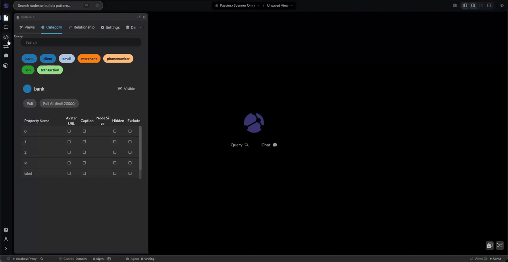

# PaySim fraud on a schemaless Spanner graph

> **Kineviz** (formerly **GraphXR**) is Kineviz's graph visualization and analytics
> platform. Some product surfaces — the Google Cloud Marketplace listing, the
> `graphxr.kineviz.com` portal, and screenshots in this repo — still show the former name.

## What you'll build

A property graph of synthetic PaySim mobile-money payments — clients, transactions,
merchants, banks, and the SSNs, emails and phone numbers that tie accounts together — inside a
**Spanner Omni** deployment running as a container on your own machine. Then you find the
accounts that share an identity *and* move money between themselves, which is the difference
between a fraud ring and a family.

What makes this demo different from [`fraud-rings`](../fraud-rings/) is the schema, or rather
the absence of one. This graph has **two tables**. Labels and properties are carried as data —
a `STRING` column and a `JSON` column — and
[`DYNAMIC LABEL` / `DYNAMIC PROPERTIES`](https://docs.cloud.google.com/spanner/docs/graph/manage-schemaless-data)
turn them into a real property graph that GQL queries like any other.

The consequence worth demoing: **adding a node type is an `INSERT`.** No DDL, no schema
update, no coordination. That is why a proof of concept picks schemaless, and it is what this
demo exists to show working end to end — into Kineviz Desktop, with the Kineviz Agent attached.

Here is that claim, run against a live deployment in 47 seconds — `:schema`, an `INSERT` that
adds a node type and an edge type, the new labels appearing in Kineviz, and both deleted
again. No DDL anywhere in it.



The same 47 seconds at native 1920x940: [`media/schemaless-proof.mp4`](media/schemaless-proof.mp4).

Spanner Omni is **pre-GA**. Nothing here is billable and nothing leaves the host.

## At a glance

| | |
|---|---|
| **Backend** | Spanner Omni `2026.r1-beta.2`, single container, `localhost:15000` |
| **Graph** | `PaysimGraph` — schemaless (`DYNAMIC LABEL` + `DYNAMIC PROPERTIES`) |
| **Tables** | 2: `GraphNode`, `GraphEdge` |
| **Labels** | 7 node · 7 edge, none of them declared in the schema |
| **Data** | ~13,700 nodes / ~25,300 edges, generated locally from a fixed seed |
| **Query language** | GQL |
| **Connect** | database proxy — `./gxr connect up paysim-schemaless` |
| **Time** | ~15 minutes |
| **Cost** | $0.00. Nothing billable exists. |

## Architecture

```
data/generate.py ──▶ GraphNode.csv        ┌──────────────── your machine ─────────────────┐
   seeded, stdlib      GraphEdge.csv      │                                               │
   no network          csv-export.json    │   ┌─────────────────────────────────────┐     │
                              │           │   │ Spanner Omni container              │     │
                              └───────────┼──▶│   GraphNode  (id, label, properties)│     │
                                          │   │   GraphEdge  (…, label, properties) │     │
                                          │   │   PaysimGraph ── DYNAMIC LABEL      │     │
                                          │   └──────────────┬──────────────────────┘     │
                                          │        :15000    │ GQL, plain text, no auth   │
                                          │                  ▼                            │
                                          │   ┌─────────────────────────────────────┐     │
                                          │   │ graphxr-database-proxy  :9080       │     │
                                          │   │   discovers labels by reading DATA  │     │
                                          │   └──────────────┬──────────────────────┘     │
                                          │                  ▼                            │
                                          │   ┌─────────────────────────────────────┐     │
                                          │   │ Kineviz Desktop  +  Kineviz Agent   │     │
                                          │   └─────────────────────────────────────┘     │
                                          └───────────────────────────────────────────────┘
```

Every arrow is on loopback. The deployment has no TLS and no authentication, so it must stay
on a machine you control.

## Prerequisites

1. **Docker** — Engine 24.0+ or Docker Desktop. The deployment is a container.
2. **Python 3.9+** — standard library only. Nothing to `pip install` for the demo itself.
3. **Hardware** — 4 vCPU / 16 GB RAM / 20 GB disk is comfortable.
4. **A Kineviz account** — [sign up](https://www.kineviz.com/). Kineviz Desktop is **free for
   individual use, forever**; the app requires sign-in. Only needed at the connect step.
5. **[Kineviz Desktop](https://github.com/Kineviz/kineviz-desktop/releases)** v0.17.1+.

`./gxr connect up` additionally needs `git` and network access, once, to fetch the proxy.

## Quick start

```bash
./gxr up paysim-schemaless        # Omni + schema + data + verify
./gxr connect up paysim-schemaless # proxy + project + the URL for Kineviz Desktop
```

The first command creates `.env` from `.env.example` if it is missing, starts the deployment
if it is not running, generates the data, applies the schema, loads the rows, and asserts with
a real query that the planted rings are findable. The second installs and runs the database
proxy and prints the URL to paste into Desktop.

## Or do it step by step

**1. Check prerequisites.** Creates nothing.

```bash
cp .env.example .env      # ./gxr up does this for you
./scripts/preflight.sh
```

**2. Start the deployment.** Idempotent — an already-running container is left alone.

```bash
../../gxr omni up
../../gxr omni status
```

Under the hood that is Google's documented setup, with one change: on macOS and Windows the
port range is published rather than using `--network host`, because the engine runs in a VM
there and host networking does not reach the host's loopback.

```bash
docker volume create spanner
docker run -d -p 15000-15026:15000-15026 --name spanneromni -v "spanner:/spanner" \
  us-docker.pkg.dev/spanner-omni/images/spanner-omni:2026.r1-beta.2 start-single-server
```

**3. Generate the payments.** Seeded, so the same numbers always produce the same graph —
including the rings the queries find.

```bash
set -a; . .env; set +a
python3 data/generate.py --out data/generated --seed "$PAYSIM_SEED" \
  --clients "$PAYSIM_CLIENTS" --transactions "$PAYSIM_TRANSACTIONS" --days "$PAYSIM_DAYS"
```

It prints the findings it planted, so you know what the queries should surface. The output is
two headerless CSVs plus a `csv-export.json` manifest — the layout Spanner's own bulk import
expects. Two tables, because a schemaless graph has two tables.

> The manifest's `typeName` for each column must be the **exact** type in the DDL. `STRING`
> where the column is `STRING(MAX)` fails the import with *"Column id has type STRING but it
> should be STRING(MAX)"*, and that message appears only inside the operation, never inline.

**4. Create the database and apply the schema.**

```bash
S="docker exec -i spanneromni /google/spanner/bin/spanner"

$S databases create "$OMNI_DATABASE"

# --ddl-file is read on the *server's* filesystem, which for a container
# deployment means inside the container. Copy it in first.
docker cp sql/01_schema.ddl spanneromni:/tmp/kineviz/01_schema.ddl
$S databases ddl update "$OMNI_DATABASE" --ddl-file=/tmp/kineviz/01_schema.ddl
```

[`sql/01_schema.ddl`](sql/01_schema.ddl) creates `GraphNode`, `GraphEdge`, and the
`PaysimGraph` property graph over them. That is the whole schema. Note there is no
`--instance` flag: the Spanner Omni CLI does not take one.

**5. Load the rows** with Spanner's own CSV import — no client library, no DML size limits.
It handles the `JSON` column, embedded commas and escaped quotes included.

```bash
docker cp data/generated spanneromni:/tmp/kineviz/data
$S databases import "$OMNI_DATABASE" --url="file:///tmp/kineviz/data" --format=csv
```

Import is asynchronous; it prints an operation name to poll with
`$S operations describe --database="$OMNI_DATABASE" <op>`.

> On `2026.r1-beta.2` that operation finishes reporting *"A step can generate output only if
> it's not a cleanup step…"* on a load that in fact wrote every row. It is preview
> bookkeeping leaking out. `setup.sh` downgrades exactly that message to a warning and then
> counts rows, which is the check that actually means something.

**6. Verify.**

```bash
./scripts/verify.sh
```

It asserts three things with real queries: that identifiers are shared, that some of those
accounts also move money to each other, and that at least five distinct node labels come back
from the *data* — the last being the check that the graph is genuinely dynamic-labelled.

## Connect Kineviz

```bash
../../gxr connect up paysim-schemaless
```

That installs [`graphxr-database-proxy`](https://github.com/Kineviz/graphxr-database-proxy)
into a gitignored `.connect/`, applies the Spanner Omni driver, starts it on loopback,
registers this database, proves the chain works, and prints the URL for Desktop.

Kineviz has **no native Spanner Omni connector** — do not pick "Spanner Property Graph" in
Desktop, it authenticates to `spanner.googleapis.com` and cannot reach a local endpoint. The
routes that work, what they cost you, and how to run the proxy by hand are all in
[`../../connect/README.md`](../../connect/README.md), including
[using the Kineviz Agent](../../connect/README.md#4--use-the-kineviz-agent) against this graph.

## Explore

Four questions, and every one of them has a shape as its answer. Run them on the Kineviz
canvas from [`queries/canvas/`](queries/canvas/), which returns nodes and edges rather than
rows. The **table** column is the same question written to run in a terminal.

| | Question | On the canvas | As a table |
|---|---|---|---|
| 1 | Which accounts share an SSN, email or phone? | [canvas](queries/canvas/01-shared-identifiers.gql) | [table](queries/01-shared-identifiers.gql) |
| 2 | Which of those also move money to each other? | [canvas](queries/canvas/02-fraud-rings.gql) | [table](queries/02-fraud-rings.gql) |
| 3 | Which accounts collect from an identity cluster? | [canvas](queries/canvas/03-collector-accounts.gql) | [table](queries/03-collector-accounts.gql) |
| 4 | Where does the value leave the network? | [canvas](queries/canvas/04-cash-out.gql) | [table](queries/04-cash-out.gql) |
| 5 | Is this actually schemaless? | [canvas](queries/canvas/05-prove-schemaless.gql) | [table](queries/05-prove-schemaless.sql) |

**Run `01` then `02`.** The first draws the identity clusters; the second keeps only the ones
that also move money, and the Oliveira family drops out. That contrast is the argument for
the graph, and it is a picture rather than a number.

Question 5 has a live version — [`scripts/prove-schemaless.sh`](scripts/prove-schemaless.sh)
adds a node type and an edge type with no DDL, asserts that the catalog did **not** change
while the data did, and removes what it added:

```bash
./scripts/prove-schemaless.sh           # insert, assert, and undo in one run
./scripts/prove-schemaless.sh --keep    # leave the new types in place to look at
./scripts/prove-schemaless.sh --undo    # remove them again
```

To run it as a demo in the Kineviz GUI rather than the terminal, follow
[`queries/README.md`](queries/README.md#in-the-kineviz-gui) — `--keep` is what
makes the new category stay long enough to point at.

Run query 2 on the Kineviz canvas rather than in a terminal — a ring is a shape, and a table
of account ids is the one representation that hides it. [`queries/canvas/`](queries/canvas/)
has all four written to return nodes and edges for exactly that, alongside the table versions
that run anywhere.

The seeded data plants two rings, a third-party takeover leg, and **one innocent family**:
three Oliveiras who share a phone and never transfer to each other. They show up in query 1
and must not show up in query 2. That contrast is the argument for the graph — a
shared-identifier rule flags them; the relationship does not.

[`queries/README.md`](queries/README.md) has what each query should return and the GQL
gotchas, schemaless edition.

## Watch it arrive

The demo above loads all 13,666 nodes at once. To watch the graph fill instead,
replay the transactions through Kafka and put a live Kineviz Dashboard on top:

```bash
./scripts/install-dashboard.sh                # finds Kineviz and the project itself
../../gxr stream up paysim-schemaless         # ~2 minutes
../../gxr stream status                       # watches it fill, live
```

The whole replay takes about two minutes, and the dashboard's KPIs climb on
their own — its database widgets re-run every two seconds, so nobody has to
press anything. Quiet stretches still stay quiet and fraud still arrives in
bursts, just closer together.

`stream status` redraws in place while it runs, so the terminal shows the same
thing the dashboard does:

```
  landed   █████████████████░░░░░░░  8619 / 12033  71%
  106 tx/s · ~32s left · 0 behind the topic
```

Only the transactions move. Clients, merchants, banks and identifiers stay
exactly as `up` loaded them, because the stream carries transactions and every
transaction needs its sender to already exist. What refills is the 88% of the
graph that is facts: ~12k `:transaction` nodes and the ~24k edges off them.

Replaying is safe to repeat. The sink writes with the same primary keys the batch
path uses, so `../../gxr stream up --keep` replays all 12,033 transactions onto a
full database and the count never moves — and `verify.sh` passes either way,
because a streamed row and a batch-loaded row are the same row.

**It runs with the network off.** Do `./gxr offline prepare` once while
connected — it pulls the images and builds the producer and sink — and after that
the whole chain is local: deployment, broker, sink, proxy, graph. `./gxr offline
check` says what is still missing, and `./gxr doctor` reports it too.

[`../../streaming/README.md`](../../streaming/README.md) has the pipeline and its
failure modes; [`kineviz/README.md`](kineviz/README.md) has the dashboard and the
two rules any query you add to it has to follow.

## How the graph is modeled

Two tables:

```sql
GraphNode (id STRING(MAX), label STRING(MAX), properties JSON)
GraphEdge (id, dest_id, edge_id, label STRING(MAX), properties JSON)
```

Seven node labels and seven edge labels, none declared in the schema:

```
(:client)-[:performs]->(:transaction)-[:to_client]->(:client)
                                     -[:to_merchant]->(:merchant)
                                     -[:to_bank]->(:bank)
(:client)-[:has_ssn]->(:ssn)   (:client)-[:has_email]->(:email)
(:client)-[:has_phone]->(:phonenumber)
```

Three modelling decisions, each forced by a constraint:

- **Transactions are nodes, not edges.** Spanner allows **at most one node table and one edge
  table** to use `DYNAMIC LABEL`. A PaySim transaction's receiver may be a client, a merchant
  or a bank, and one edge table cannot bind three destination types. Reifying is how a
  polymorphic relationship fits a single-edge-table world — and it is also what the published
  [`Kineviz/paysim`](https://github.com/Kineviz/paysim) schemaless importer does, so the two
  tell the same story.
- **The business id lives in the column, not the JSON.** `id` and `label` are real columns, so
  Spanner exposes them as *defined* properties — and defined properties **shadow** dynamic
  ones. A JSON key named `id` would be unreachable. So node ids are prefixed
  (`client_C0387`, `transaction_T000042`) and the JSON carries everything else.
- **Labels and property names are lowercase.** Spanner requires it for schemaless matching.
  `MATCH (n:Client)` finds nothing.

One thing is there on purpose: **not every node with the same label carries the same
properties.** Only mule accounts have `fraud_typology`; only high-risk merchants have
`risk_reason`.

> Before you demo it: the proxy builds its schema panel by sampling
> **one row per label**, so a property that exists on only some nodes may not appear in
> Kineviz's schema list. It queries fine either way.

## Troubleshooting

**`Failed to find element label`** — labels in a schemaless graph are data, so they are
whatever was inserted, and Spanner requires them lowercase. `MATCH (n:Client)` finds nothing;
`MATCH (n:client)` works. List what is actually there:

```bash
../../connect/verify.sh --database kineviz-paysim-demo --graph PaysimGraph
```

**`No matching signature for function STRING`** — you coerced something that is already a
scalar, or forgot to coerce something that is JSON. `id` and `label` are real columns and need
no wrapper. Everything else is a dynamic property: `STRING(n.name)`, `FLOAT64(t.amount)`,
`BOOL(m.highrisk)`.

**A query returns `GraphNode` where you expected a label** — you used
`LABELS(n)[OFFSET(0)]`. Every schemaless node carries two labels, its own and the table's, and
`LABELS()` returns them sorted, so `OFFSET(0)` yields `GraphNode` for every label
alphabetically after it. Use the `label` column.

**The import operation reports an error but the data is there** — see the note in step 5. Row
counts are the evidence; `verify.sh` is what decides.

**`Column id has type STRING but it should be STRING(MAX)`** — `csv-export.json` and the DDL
have drifted. The manifest's `typeName` must match the column type exactly.

**Kineviz shows one category called `GraphNode`** — the proxy fell back to static schema
introspection, which means it did not recognise the graph as schemaless. Check that
`sql/01_schema.ddl` still declares `DYNAMIC LABEL (label)`. `./gxr connect up` warns about
this rather than letting it pass silently.

**A totals column looks about twice as large as it should** — comma-joining two graph patterns
yields one row per combination, so an identity cluster multiplies the money rows. See the note
in `queries/03-collector-accounts.gql`.

More in [`../../docs/TROUBLESHOOTING.md`](../../docs/TROUBLESHOOTING.md).

## Clean up

```bash
../../gxr connect down                     # stops the proxy; touches nothing else
../../gxr down paysim-schemaless           # drops the database, keeps the deployment
```

Teardown removes exactly what setup created: the `kineviz-paysim-demo` database and the
locally generated CSVs. The container and its volume are left alone — the volume holds every
database on the deployment, including ones that have nothing to do with this repo. Removing
the deployment itself is a separate, deliberate act:

```bash
../../gxr omni destroy --all               # asks first; destroys every database on it
```

## What's next

- Try the other demos: [`fraud-rings`](../fraud-rings/) is the same fraud question on a
  **standard** Spanner Graph schema — a useful side-by-side if you are deciding between the
  two — and [`edge-fleet`](../edge-fleet/) is dependency analysis on an IoT fleet.
- Prove it is schemaless rather than take the word for it. `./scripts/prove-schemaless.sh`
  adds a node type and an edge type with no DDL, no schema update and no restart, asserts the
  catalog is untouched while the data grew, shows the new category arriving in Kineviz without
  a reconnect, and puts everything back.
- Point the Kineviz Agent at it — [`../../connect/README.md`](../../connect/README.md#4--use-the-kineviz-agent).
